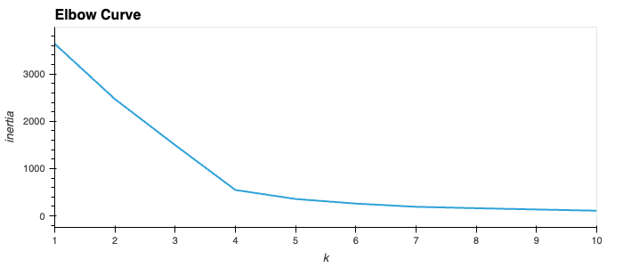
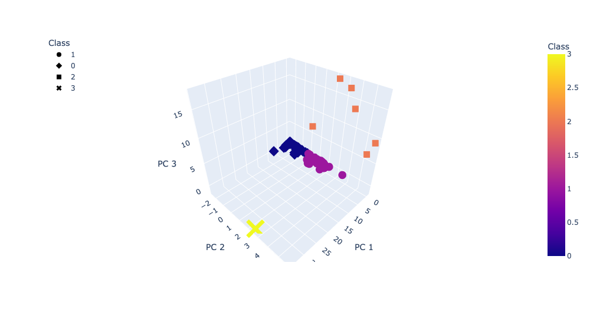
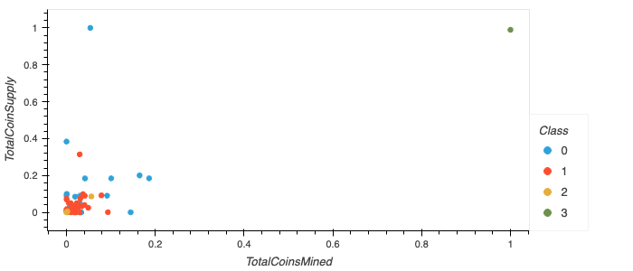
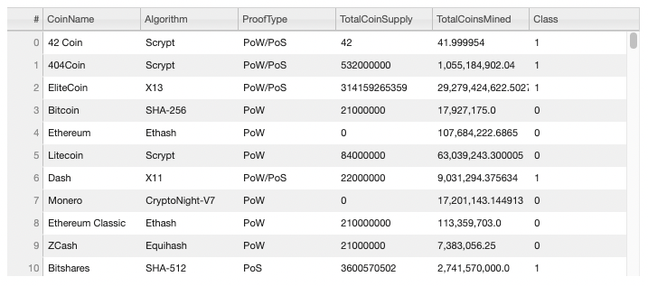

# Cryptocurrencies

## Overview

The purpose of this project is using an unsupervised machine learning algorithm to create a report on current cryptocurrencies trading in the market and classifying them using Principal Component Analysis (PCA).

* Deliverable 1: Preprocessing the Data for PCA
* Deliverable 2: Reducing Data Dimensions Using PCA
* Deliverable 3: Clustering Cryptocurrencies Using K-means
* Deliverable 4: Visualizing Cryptocurrencies Results

## Results

After cleaning the given dataset, the dataframe dropped from 1252 Cryptocurrencies to 532. Unsupervised machine learning was used to identify clusters of cryptocurrencies.

### Elbow Curve
The Elbow Curve below shows that 4 clusters would be the optimal output to categorize the cryptocurrencies. Classes 0, 1, 2, & 3 will be used. Four clusters were then used in the K-means algorithm and PCA to obtain PC1, PC2, & PC3.

### 3D Scatterplot
PC1, PC2, & PC3 were plotted on the 3D Scatterplot below with classes 0, 1, 2, &3 displaying the tradeable cryptocurrencies.

### 2D Scatterplot
Classes 0, 1, 2, &3 of the tradeable cryptocurrencies are plotted to show Total Coins Supply vs. the Total Coins Mined.

### Tradable Cryptocurrency Table
532 Tradable Cryptocurrencies:

## Summary
532 tradable cryptocurrencies were identified and classified based on their similarities. 
